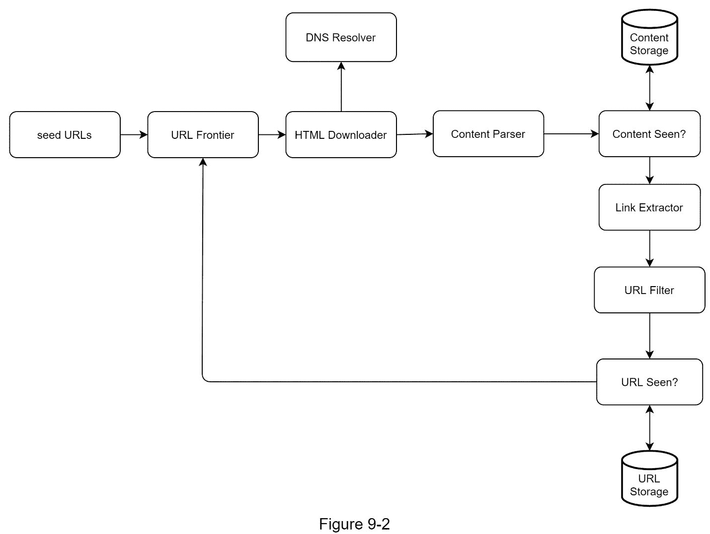
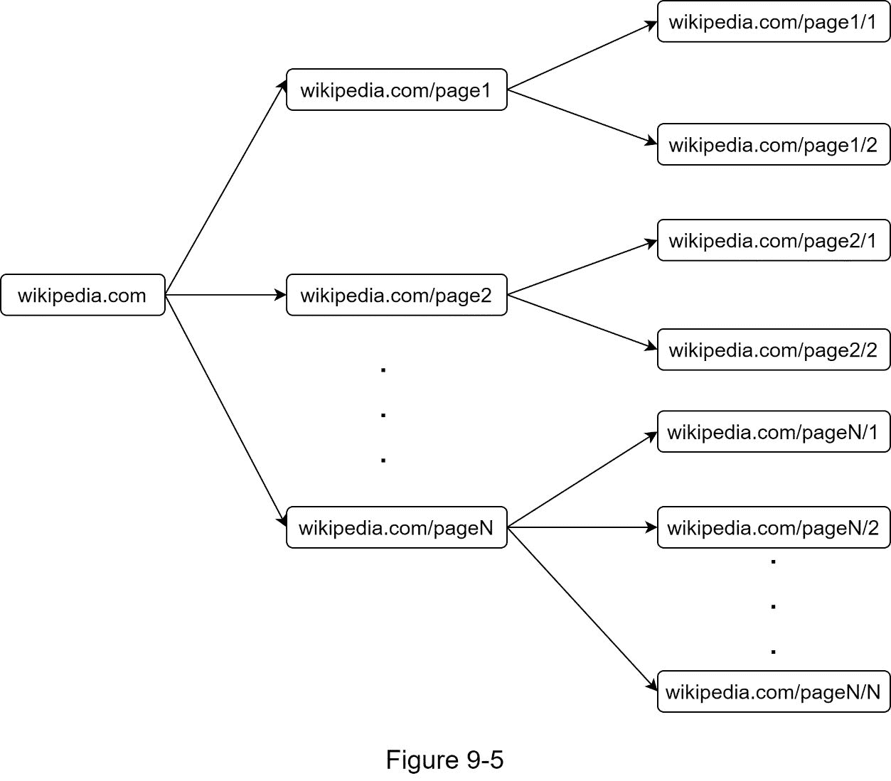
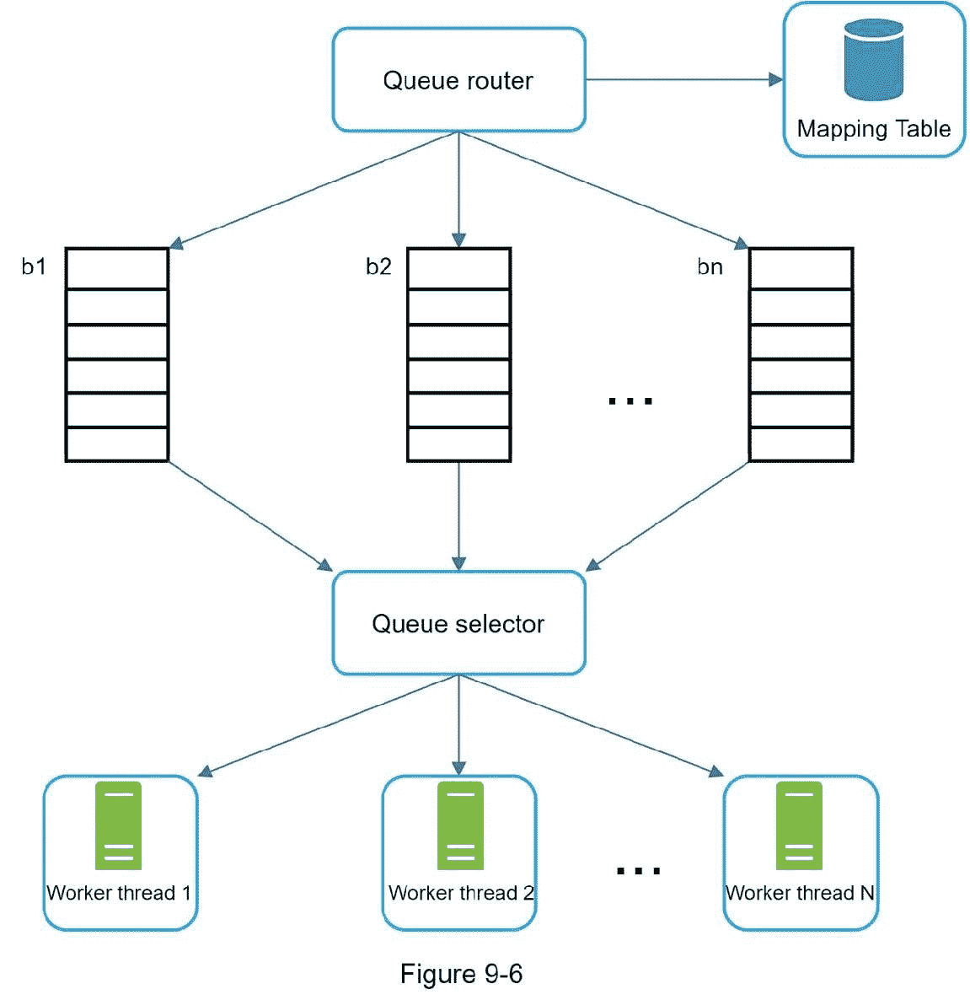
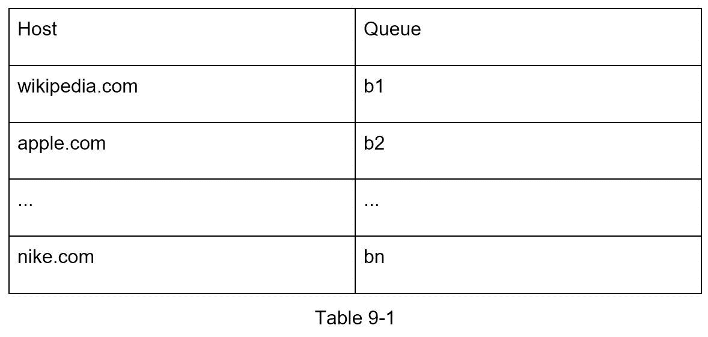
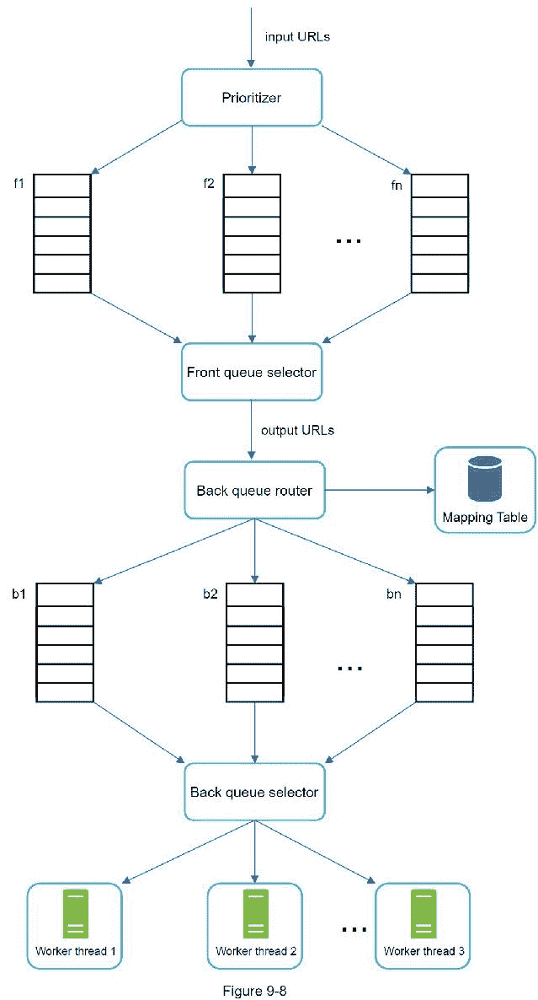

# 九、设计网络爬虫

在这一章中，我们关注网络爬虫设计:一个有趣而经典的系统设计面试问题。

网络爬虫被称为机器人或蜘蛛。搜索引擎广泛使用它来发现 web 上新的或更新的内容。内容可以是网页、图像、视频、PDF 文件等。网络爬虫从收集一些网页开始，然后跟随这些网页上的链接来收集新的内容。图 9-1 显示了爬行过程的一个可视化例子。

爬虫有多种用途:

搜索引擎索引:这是最常见的用例。爬虫收集网页来为搜索引擎创建本地索引。例如，Googlebot 是谷歌搜索引擎背后的网络爬虫。

网络存档:这是从网络上收集信息以保存数据供将来使用的过程。例如，许多国家图书馆运行爬虫来存档网站。著名的例子是美国国会图书馆[1]和欧盟网络档案馆[2]。

Web 挖掘:Web 的爆炸式增长为数据挖掘带来了前所未有的机遇。Web 挖掘有助于从互联网上发现有用的知识。例如，顶级金融公司使用爬虫下载股东会议和年度报告，以了解关键的公司举措。

网络监控。这些爬虫帮助监控互联网上的版权和商标侵权行为。例如，Digimarc [3]利用爬虫来发现盗版作品和报告。

开发一个网络爬虫的复杂性取决于我们打算支持的规模。它可以是一个只需要几个小时就能完成的小型学校项目，也可以是一个需要专业工程团队不断改进的大型项目。由此，我们将在下面探讨尺度和特性来支持 。

## 步骤 1 -了解问题并确定设计范围

网络爬虫的基本算法很简单:

1。给定一组 URL，下载由这些 URL 寻址的所有网页。

2。从这些网页中提取网址

3。向要下载的 URL 列表中添加新的 URL。重复这三个步骤。

网络爬虫的工作真的像这个基本算法这么简单吗？不完全是。设计一个高度可扩展的网络爬虫是一项极其复杂的任务。任何人都不太可能在面试时间内设计出一个庞大的网络爬虫。在跳入设计之前，我们必须提出问题，了解需求，建立设计范围:

候选 : 爬虫的主要用途是什么？是用于搜索引擎索引，数据挖掘，还是其他？

面试官 : 搜索引擎索引。

候选 : 网络爬虫每月收集多少网页？

面试官:10 亿页。

候选 : 包含哪些内容类型？仅 HTML 还是 pdf 和图像等其他内容类型？

面试官 :只有 HTML。

候选 : 我们要考虑新增或编辑的网页吗？

面试官 : 是的，要考虑新增加或编辑的网页。

候选人 : 我们需要存储从 web 上抓取的 HTML 页面吗？

面试官 : 是的，最多 5 年

候选人 : 我们如何处理内容重复的网页？

面试官 : 内容重复的页面应忽略。

以上是你可以问面试官的一些问题。理解需求和澄清歧义是很重要的。即使你被要求设计一个像网络爬虫这样简单明了的产品，你和你的面试官可能也不会有相同的假设。

除了向你的面试官澄清功能之外，记下一个好的网络爬虫的以下特征也很重要

可扩展性:web 非常大。外面有数十亿的网页。 

健壮性:网络充满陷阱。糟糕的 HTML，没有反应的服务器，崩溃，恶意链接等。都很常见。爬虫必须处理所有这些边缘情况。

礼貌:爬虫不要在短时间间隔内向一个网站提出太多请求。

可扩展性 :系统非常灵活，只需很小的改动就能支持新的内容类型。例如，如果我们将来想要抓取图像文件，我们应该不需要重新设计整个系统。

### 信封估算的背面

下面的估计是基于许多假设的，与面试官沟通以达成共识是很重要的。

假设每月有 10 亿个网页被下载。

QPS:30 天/ 24 小时/ 3600 秒=每秒~400 页。

峰值 QPS = 2 * QPS = 800

假设平均网页大小为 500k。

10 亿页 x 500k =每月 500 TB 存储。如果你对数字存储单元不清楚，请再次阅读第 2 章的“2 的幂”一节。

假设数据存储五年，500 TB * 12 个月* 5 年= 30 PB。需要 30 PB 的存储空间来存储五年的内容。

## 第二步-提出高层次设计并获得认同

一旦明确了需求，我们就进入高层次的设计。受之前关于网页抓取的研究的启发[4] [5]，我们提出了一个如图 9-2 所示的高级设计。

首先，我们探索每个设计组件，了解它们的功能。然后，我们一步一步地检查爬虫工作流。

种子网址

网络爬虫使用种子 URL 作为爬行过程的起点。例如，要从一所大学的网站抓取所有网页，选择种子 URL 的直观方法是使用该大学的域名。

为了抓取整个网络，我们需要在选择种子 URL 时有创意。一个好的种子 URL 是一个好的起点，爬虫可以利用它遍历尽可能多的链接。一般的策略是将整个 URL 空间分成更小的空间。第一种提出的方法是基于位置的，因为不同的国家可能有不同的流行网站。另一种方式是根据主题选择种子 URLs 例如，我们可以将 URL 空间划分为购物、运动、医疗保健等。种子 URL 选择是一个开放式问题。不指望你给出完美的答案。大声想出来。

URL 边界

大多数现代网络爬虫将抓取状态分为两种:待下载和已下载。存储要下载的 URL 的组件称为 URL Frontier。你可以称之为先进先出(FIFO)队列。有关 URL 边界的详细信息，请参考深入探讨。

HTML 下载程序

HTML 下载程序从互联网上下载网页。这些 URL 由 URL Frontier 提供。

DNS 解析器

要下载网页，必须将 URL 转换成 IP 地址。HTML 下载程序调用 DNS 解析器来获取 URL 的相应 IP 地址。例如，从 2019 年 3 月 5 日起，URL www.wikipedia.org 将转换为 IP 地址 198.35.26.96。

内容解析器

下载网页后，必须对其进行解析和验证，因为格式错误的网页会引发问题并浪费存储空间。 在爬行服务器中实现内容解析器会减慢爬行过程。因此，内容解析器是一个独立的组件。

看过的内容？

在线研究[6]显示，29%的网页是重复的内容，这可能导致相同的内容被多次存储。我们介绍“内容看过了吗？”数据结构来消除数据冗余并缩短处理时间。它有助于检测系统中先前存储的新内容。要比较两个 HTML 文档，我们可以逐字符比较。然而，这种方法既慢又耗时，尤其是当涉及数十亿个网页时。完成这项任务的有效方法是比较两个网页的哈希值[7]。

内容存储

它是一个存储 HTML 内容的存储系统。存储系统的选择取决于数据类型、数据大小、访问频率、生命周期等因素。磁盘和内存都要用。

大部分内容都存储在磁盘上，因为数据集太大，内存放不下。

流行内容被保存在内存中以减少延迟。

网址提取器

URL 提取器解析并提取 HTML 页面中的链接。图 9-3 显示了一个链接提取过程的例子。通过添加“https://en.wikipedia.org”前缀，相对路径被转换为绝对 URL。

URL 过滤器

URL 过滤器排除“黑名单”网站中的某些内容类型、文件扩展名、错误链接和 URL。

网址见过？

“网址看到了吗？”是一种数据结构，用于跟踪之前访问过的 URL 或已经在前沿访问过的 URL。"看到网址了吗？"有助于避免多次添加相同的 URL，因为这可能会增加服务器负载并导致潜在的无限循环。

布隆过滤器和哈希表是实现“URL 是否可见？”的常用技术组件。我们不会在这里讨论 bloom filter 和 hash 表的详细实现。有关更多信息，请参考参考资料[4] [8]。

网址存储

URL 存储存储已经访问过的 URL。

到目前为止，我们已经讨论了每个系统组件。接下来，我们将它们放在一起解释工作流程。

网络爬虫工作流程

为了更好地解释工作流程，在设计图中增加了顺序号，如图 9-4 所示。

步骤 1:将种子 URL 添加到 URL 边界

步骤 2: HTML 下载程序从 URL Frontier 获取一个 URL 列表。

第三步:HTML Downloader 从 DNS 解析器获取 URL 的 IP 地址，开始下载。

步骤 4:内容解析器解析 HTML 页面并检查页面是否格式错误。

步骤 5:在内容被解析和验证之后，它被传递给“内容是否被看到？”组件。

步骤 6:“内容可见”组件检查 HTML 页面是否已经在存储器中。

如果在存储中，这意味着不同 URL 中的相同内容已经被处理。在这种情况下，HTML 页面将被丢弃。

如果不在存储中，系统之前没有处理过相同的内容。内容被传递到链接提取器。

第 7 步:链接提取器从网页中提取链接。

步骤 8:提取的链接被传递给 URL 过滤器。

步骤 9:在链接被过滤后，它们被传递给“URL 是否可见？”组件。

步骤 10:“URL Seen”组件检查一个 URL 是否已经在存储器中，如果是，则它之前被处理过，并且不需要做任何事情。

步骤 11:如果一个 URL 以前没有被处理过，它被添加到 URL 边界。

## 步骤 3 -设计深度潜水

到目前为止，我们已经讨论了高层设计。接下来，我们将深入讨论最重要的建筑构件和技术:

深度优先搜索(DFS) vs 广度优先搜索(BFS)

网址前沿

HTML 下载工具

鲁棒性

扩展性

检测并避免有问题的内容

### DFS 与 BFS 的比较

你可以把网络想象成一个有向图，网页作为节点，超链接(URL)作为边。爬行过程可以被视为从一个网页到另一个网页遍历有向图。两种常见的图遍历算法是 DFS 和 BFS。但是，DFS 通常不是一个好的选择，因为 DFS 的深度可能非常深。

BFS 通常由网络爬虫使用，并通过先进先出(FIFO)队列来实现。在 FIFO 队列中，URL 按照它们入队的顺序出队。然而，这种实现有两个问题:

来自同一个网页的大多数链接都链接回同一个主机。在图 9-5 中，wikipedia.com 的所有链接都是内部链接，使得爬虫忙于处理来自同一主机(Wikipedia . com)的 URL。当爬虫试图并行下载网页时，维基百科服务器会被请求淹没。这被认为是“不礼貌的”。

标准 BFS 不考虑 URL 的优先级。网络很大，不是每个页面都有相同的质量和重要性。因此，我们可能希望根据 URL 的页面排名、web 流量、更新频率等来确定它们的优先级。

### URL 边界

URL frontier 有助于解决这些问题 。URL 边界是存储要下载的 URL 的数据结构。URL 边界是确保礼貌、URL 优先级和新鲜度的重要组成部分。参考资料[5] [9]中提到了几篇值得注意的关于 URL 边界的论文。这些论文的研究结果如下:

#### 礼貌

一般来说，网络爬虫应该避免在短时间内向同一个主机服务器发送太多请求。发送过多的请求被认为是“不礼貌的”，甚至会被视为拒绝服务(DOS)攻击。例如，在没有任何约束的情况下，爬虫每秒钟可以向同一个网站发送数千个请求。这可能会使 web 服务器不堪重负。

加强礼貌的总体思路是从同一个主机上一次下载一个页面。可以在两个下载任务之间添加延迟。通过维护从网站主机名到下载(工作)线程映射来实现礼貌约束。每个下载器线程都有一个单独的 FIFO 队列，并且只下载从该队列获得的 URL。图 9-6 显示了管理礼貌的设计。

队列路由器:它确保每个队列(b1，b2，… bn)只包含来自同一个主机的 URL。

映射表:将每台主机映射到一个队列。

FIFO 队列 b1、b2 到 bn:每个队列包含来自同一主机的 URL。

队列选择器:每个工作线程被映射到一个 FIFO 队列，它只从那个队列下载 URL。队列选择逻辑由队列选择器完成。

工作线程 1 到 n 一个工作线程从同一个主机上一个接一个的下载网页。可以在两个下载任务之间添加延迟。

#### 优先级

来自苹果产品论坛的随机帖子与苹果主页上的帖子具有非常不同的权重。尽管它们都有“Apple”关键字，但对于爬虫来说，首先爬取 Apple 主页是明智的。

我们根据有用性对 URL 进行优先排序，有用性可以通过 PageRank [10]、网站流量、更新频率等来衡量。“优先排序器”是处理 URL 优先排序的组件。请参考参考资料[5] [10]以深入了解这一概念。

图 9-7 显示了管理 URL 优先级的设计。

优先级排序器:它将 URL 作为输入并计算优先级。

队列 f1 到 fn:每个队列都有一个指定的优先级。具有高优先级的队列以较高的概率被选择。

队列选择器:随机选择一个偏向高优先级队列的队列。

图 9-8 展示了 URL 边界设计，它包含两个模块:

前排队列:管理优先级

后排:管理礼貌

#### 新鲜度

网页不断地被添加、删除和编辑。网络爬虫必须定期重新抓取下载的页面，以保持我们的数据集新鲜。重新搜索所有的 URL 既耗时又耗费资源。下面列出了一些优化新鲜度的策略:

基于网页更新历史重新抓取。

优先处理网址，首先更频繁地重新抓取重要网页。

#### URL 边界的存储

在搜索引擎的真实世界抓取中，前沿的 URL 数量可能是数亿个[4]。把所有东西都放在内存中既不耐用也不可伸缩。将所有东西都保存在磁盘中也是不可取的，因为磁盘很慢；这很容易成为爬行的瓶颈。

我们采用了混合方法。大多数 URL 都存储在磁盘上，所以存储空间不是问题。为了降低从磁盘读取和向磁盘写入的成本，我们在内存中维护用于入队/出队操作的缓冲区。缓冲区中的数据会定期写入磁盘。

### HTML 下载程序

HTML 下载器使用 HTTP 协议从互联网下载网页。在讨论 HTML 下载器之前，我们先来看看 Robots 排除协议。

Robots.txt

Robots.txt，称为 Robots Exclusion Protocol，是网站用来与爬虫通信的标准。它指定允许爬虫下载哪些页面。在尝试对网站进行爬网之前，爬网程序应首先检查其对应的 robots.txt 并遵循其规则。

为了避免重复下载 robots.txt 文件，我们缓存了该文件的结果。文件会定期下载并保存到缓存中。这里有一段来自 https://www.amazon.com/robots.txt.的 robots.txt 文件，其中一些目录如 creatorhub 是谷歌机器人不允许的。

用户代理:Googlebot

不允许:/creatorhub/*

不允许:/rss/people/*/reviews

不允许:/gp/pdp/rss/*/reviews

不允许:/gp/CDP/会员评论/

不允许:/gp/aw/cr/

除了 robots.txt，性能优化是我们将为 HTML 下载器介绍的另一个重要概念。

#### 性能优化

下面是 HTML 下载程序的性能优化列表。

1。分布式抓取

为了实现高性能，爬行作业被分布到多个服务器上，并且每个服务器运行多个线程。URL 空间被分割成更小的部分；因此，每个下载器负责 URL 的一个子集。图 9-9 显示了一个分布式抓取的例子。

2。缓存 DNS 解析器

DNS 解析器是爬虫的瓶颈，因为由于许多 DNS 接口的同步性质，DNS 请求可能需要时间。DNS 响应时间从 10 毫秒到 200 毫秒不等。一旦 crawler 线程执行了对 DNS 的请求，其他线程就会被阻塞，直到第一个请求完成。维护我们的 DNS 缓存以避免频繁调用 DNS 是一种有效的速度优化技术。我们的 DNS 缓存保存域名到 IP 地址的映射，并由 cron 作业定期更新。

3。地点

在地理上分布爬行服务器。当爬网服务器离网站主机越近，爬网程序的下载时间就越快。设计局部性适用于大多数系统组件:爬网服务器、缓存、队列、存储等。

4。短暂超时

一些网络服务器响应缓慢或者根本没有响应。为了避免长时间等待，规定了最大等待时间。如果主机在预定义的时间内没有响应，crawler 将停止作业并搜索其他一些页面。

### 鲁棒性

除了性能优化，健壮性也是一个重要的考虑因素。我们提出了几种提高系统鲁棒性的方法:

一致哈希:这有助于在下载者之间分配负载。可以使用一致哈希来添加或删除新的下载器服务器。更多细节请参考第 5 章:设计一致哈希。

保存抓取状态和数据:为了防止失败，抓取状态和数据被写入存储系统。通过加载保存的状态和数据，可以轻松重启中断的爬网。

异常处理:在大规模系统中，错误是不可避免的，也是常见的。爬虫必须在不使系统崩溃的情况下优雅地处理异常。

数据验证:这是防止系统出错的重要措施。

### 扩展性

随着几乎每个系统的发展，设计目标之一是使系统足够灵活以支持新的内容类型。爬行器可以通过插入新模块来扩展。图 9-10 显示了如何添加新模块。

插入 PNG 下载器模块，下载 PNG 文件。

新增网络监控模块，监控网络，防止侵犯版权和商标。

### 检测并避免有问题的内容

本节讨论检测和预防多余的、 无意义的或有害的内容。

1。冗余内容

如前所述，近 30%的网页是重复的。哈希或校验和有助于检测重复[11]。

2。蜘蛛陷阱

蜘蛛陷阱是一个网页，它会使爬虫陷入无限循环。例如，一个无限深的目录结构如下所示:[【www.spidertrapexample.com/foo/bar/foo/bar/foo/bar/…】](http://www.spidertrapexample.com/foo/bar/foo/bar/foo/bar/%E2%80%A6)

通过设置 URL 的最大长度可以避免这种蜘蛛陷阱。然而，不存在一种通用的解决方案来检测蜘蛛陷阱。包含蜘蛛陷阱的网站很容易识别，因为在此类网站上发现的网页异常多。很难开发自动算法来避免蜘蛛陷阱；但是，用户可以手动验证和识别蜘蛛陷阱，并从 crawler 中排除这些网站或应用一些定制的 URL 过滤器。

3。数据噪声

有些内容几乎没有价值，例如广告、代码片段、垃圾网址等。这些内容对爬网程序没有用，应该尽可能排除。

## 第四步——总结

在这一章中，我们首先讨论了优秀爬虫的特征:可伸缩性、礼貌性、可扩展性和健壮性。然后，我们提出了一个设计方案，并讨论了关键部件。构建一个可伸缩的网络爬虫并不是一个简单的任务，因为网络非常庞大，充满了陷阱。尽管我们已经涵盖了许多主题，但我们仍然错过了许多相关的话题:

服务器端渲染:许多网站使用 JavaScript、AJAX 等脚本动态生成链接。如果我们直接下载和解析网页，我们将无法检索动态生成的链接。为了解决这个问题，我们在解析页面之前先执行服务器端渲染(也称为动态渲染)[12]。

过滤掉不想要的页面:在有限的存储容量和抓取资源下，反垃圾邮件组件有利于过滤掉低质量和垃圾页面[13] [14]。

数据库复制和分片:复制和分片等技术用于提高数据层的可用性、可伸缩性和可靠性。

横向扩展:对于大规模的抓取，需要数百甚至数千台服务器来执行下载任务。关键是保持服务器无状态。

可用性、一致性和可靠性:这些概念是任何大型系统成功的核心。我们在第一章中详细讨论了这些概念。请回忆一下这些话题。

分析:收集和分析数据是任何系统的重要组成部分，因为数据是微调的关键因素。

祝贺你走到这一步！现在给自己一个鼓励。干得好！

参考资料

【1】美国国会图书馆:[https://www.loc.gov/websites/](https://www.loc.gov/websites/)

【2】欧盟网页存档:

【3】digi Marc:[https://www . digi Marc . com/products/digi Marc-services/盗版-intelligence](https://www.digimarc.com/products/digimarc-services/piracy-intelligence)

[4] Heydon A .，Najork M. Mercator:一个可伸缩的、可扩展的网络爬虫万维网，2 (4) (1999)，第 219-229 页

克里斯托弗·奥尔斯顿，马克·纳约克:网络爬行。[http://infolab . Stanford . edu/~ olston/publications/crawling _ survey . pdf](http://infolab.stanford.edu/~olston/publications/crawling_survey.pdf)

【6】29%的网站面临内容重复问题:[【https://tinyurl.com/y6tmh55y】](https://tinyurl.com/y6tmh55y)

[7] Rabin M.O .等，计算技术研究中心的随机多项式指纹。大学艾肯计算实验室(1981 年)

【8】b . h . Bloom，“允许误差的哈希编码中的空间/时间权衡”，

美国计算机学会通讯，第 13 卷，第 7 期，第 422-426 页，1970 年。

【9】唐纳德·j·帕特森，网络爬行:

[https://www . ics . UCI . edu/~ Lopes/teaching/cs 221 w 12/slides/lecture 05 . pdf](https://www.ics.uci.edu/~lopes/teaching/cs221W12/slides/Lecture05.pdf)

[10] L. Page，S. Brin，R. Motwani 和 T. Winograd，“PageRank 引文

排名:给网络带来秩序，《技术报告》，斯坦福大学，

1998 年。

【11】伯顿·布鲁姆。具有容许误差的哈希编码中的空间/时间权衡。美国计算机学会通讯，第 13 卷第 7 期，第 422 - 426 页，1970 年 7 月。

【12】谷歌动态渲染:[https://developers . Google . com/search/docs/guides/Dynamic-Rendering](https://developers.google.com/search/docs/guides/dynamic-rendering)

[13] T. Urvoy、T. Lavergne 和 P. Filoche，“使用隐藏风格相似性跟踪网络垃圾邮件”，载于《第二届网上对抗性信息检索国际研讨会论文集》，2006 年。

[14] H.-T. Lee、D. Leonard、X. Wang 和 D. Loguinov，“IRLbot:扩展到 60 亿页及以上”，载于 2008 年第 17 届国际万维网会议记录。